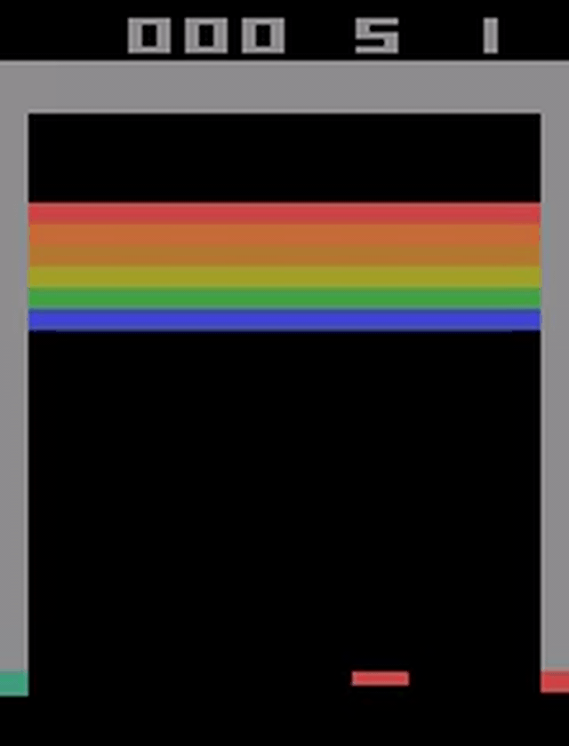

# Breakout DQN
## Update 
### 2025.10.16
受资源限制，在训练了约2M帧得到结果如下。可以看出其学习到了一些知识，但是效果不佳。一方面考虑到训练的帧数不够，另一方面考虑到根据Rainbow的原论文，distributional对于breakout游戏的提升极大，同时priority对于DQN的性能降低也极大，而我添加了priority，同时因为资源问题没有应用distributional，所以这个结果也情有可原。

## Introduction
在学习完DRL的一些资料后我决定尝试学习写一个网络。开始选择了简单的DQN来解决breakout问题。在阅读了Rainbow等论文和资料后添加上了部分Rainbow的部件。仅作为学习项目。
## Network Design
网络设计实现了Rainbow中6个部件中的4个在main中，同时fix-tests中有第5个distributional的实现，但是由于在实际测试中会增加大量的训练时间，由于训练资源不足没有实际使用。n-steps最终没有添加成功，同时在论文中对于breakout没有益处最终也没有实现。
## Usage
```bash
conda env create -f docs/environment.yml
python -m pip install -r docs/requirements.txt
```
所有的参数都简单的放置在config.py中，主要的流程在main.py中，predict.py中提供了测试的脚本，其他文件提供了必要的工具。
